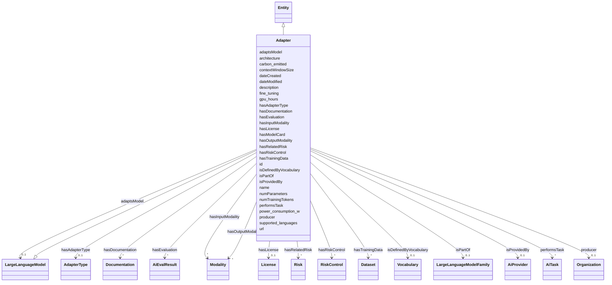

# Class: Adapter


_Adapter-based methods add extra trainable parameters after the attention and fully-connected layers of a frozen pretrained model to reduce memory-usage and speed up training. The adapters are typically small but demonstrate comparable performance to a fully finetuned model and enable training larger models with fewer resources. (https://huggingface.co/docs/peft/en/conceptual_guides/adapter)_


URI: [nexus:Adapter](https://ibm.github.io/risk-atlas-nexus/ontology/Adapter)





## Inheritance
* [Entity](Entity.md)
    * **Adapter** [ [LargeLanguageModel](LargeLanguageModel.md)]


## Slots

| Name | Cardinality and Range | Description | Inheritance |
| ---  | --- | --- | --- |
| [hasAdapterType](hasAdapterType.md) | 0..1 <br/> [AdapterType](AdapterType.md) | The Adapter type, for example: LORA, ALORA, X-LORA | direct |
| [isDefinedByVocabulary](isDefinedByVocabulary.md) | 0..1 <br/> [Vocabulary](Vocabulary.md) | A relationship where a term or a term group is defined by a vocabulary | direct |
| [hasDocumentation](hasDocumentation.md) | * <br/> [Documentation](Documentation.md) | Indicates documentation associated with an entity | direct |
| [hasLicense](hasLicense.md) | 0..1 <br/> [License](License.md) | Indicates licenses associated with a resource | direct |
| [hasRelatedRisk](hasRelatedRisk.md) | * <br/> [Risk](Risk.md)&nbsp;or&nbsp;<br />[RiskConcept](RiskConcept.md)&nbsp;or&nbsp;<br />[Term](Term.md) | A relationship where an entity relates to a risk | direct |
| [adaptsModel](adaptsModel.md) | 0..1 <br/> [LargeLanguageModel](LargeLanguageModel.md) | The LargeLanguageModel being adapted | direct |
| [numParameters](numParameters.md) | 0..1 <br/> [Integer](Integer.md) | A property indicating the number of parameters in a LLM | [LargeLanguageModel](LargeLanguageModel.md) |
| [numTrainingTokens](numTrainingTokens.md) | 0..1 <br/> [Integer](Integer.md) | The number of tokens a AI model was trained on | [LargeLanguageModel](LargeLanguageModel.md) |
| [contextWindowSize](contextWindowSize.md) | 0..1 <br/> [Integer](Integer.md) | The total length, in bytes, of an AI model's context window | [LargeLanguageModel](LargeLanguageModel.md) |
| [hasInputModality](hasInputModality.md) | * <br/> [Modality](Modality.md) | A relationship indicating the input modalities supported by an AI component | [LargeLanguageModel](LargeLanguageModel.md) |
| [hasOutputModality](hasOutputModality.md) | * <br/> [Modality](Modality.md) | A relationship indicating the output modalities supported by an AI component | [LargeLanguageModel](LargeLanguageModel.md) |
| [hasTrainingData](hasTrainingData.md) | * <br/> [Dataset](Dataset.md) | A relationship indicating the datasets an AI model was trained on | [LargeLanguageModel](LargeLanguageModel.md) |
| [fine_tuning](fine_tuning.md) | 0..1 <br/> [String](String.md) | A description of the fine-tuning mechanism(s) applied to a model | [LargeLanguageModel](LargeLanguageModel.md) |
| [supported_languages](supported_languages.md) | * <br/> [String](String.md) | A list of languages, expressed as ISO two letter codes | [LargeLanguageModel](LargeLanguageModel.md) |
| [isPartOf](isPartOf.md) | 0..1 <br/> [LargeLanguageModelFamily](LargeLanguageModelFamily.md) | Annotation that a Large Language model is part of a family of models | [LargeLanguageModel](LargeLanguageModel.md) |
| [id](id.md) | 1 <br/> [String](String.md) | A unique identifier to this instance of the model element | [Entity](Entity.md) |
| [name](name.md) | 0..1 <br/> [String](String.md) | A text name of this instance | [Entity](Entity.md) |
| [description](description.md) | 0..1 <br/> [String](String.md) | The description of an entity | [Entity](Entity.md) |
| [url](url.md) | 0..1 <br/> [Uri](Uri.md) | An optional URL associated with this instance | [Entity](Entity.md) |
| [dateCreated](dateCreated.md) | 0..1 <br/> [Date](Date.md) | The date on which the entity was created | [Entity](Entity.md) |
| [dateModified](dateModified.md) | 0..1 <br/> [Date](Date.md) | The date on which the entity was most recently modified | [Entity](Entity.md) |
| [hasEvaluation](hasEvaluation.md) | * <br/> [AiEvalResult](AiEvalResult.md) | A relationship indicating that an entity has an AI evaluation result | [AiModel](AiModel.md) |
| [architecture](architecture.md) | 0..1 <br/> [String](String.md) | A description of the architecture of an AI such as 'Decoder-only' | [AiModel](AiModel.md) |
| [gpu_hours](gpu_hours.md) | 0..1 <br/> [Integer](Integer.md) | GPU consumption in terms of hours | [AiModel](AiModel.md) |
| [power_consumption_w](power_consumption_w.md) | 0..1 <br/> [Integer](Integer.md) | power consumption in Watts | [AiModel](AiModel.md) |
| [carbon_emitted](carbon_emitted.md) | 0..1 <br/> [Float](Float.md) | The number of tons of carbon dioxide equivalent that are emitted during train... | [AiModel](AiModel.md) |
| [hasRiskControl](hasRiskControl.md) | * <br/> [RiskControl](RiskControl.md) | Indicates the control measures associated with a system or component to modif... | [AiModel](AiModel.md) |
| [producer](producer.md) | 0..1 <br/> [Organization](Organization.md) | A relationship to the Organization instance which produces this instance | [BaseAi](BaseAi.md) |
| [hasModelCard](hasModelCard.md) | * <br/> [String](String.md) | A relationship to model card references | [BaseAi](BaseAi.md) |
| [performsTask](performsTask.md) | * <br/> [AiTask](AiTask.md) | relationship indicating the AI tasks an AI model can perform | [BaseAi](BaseAi.md) |
| [isProvidedBy](isProvidedBy.md) | 0..1 <br/> [AiProvider](AiProvider.md) | A relationship indicating the AI model has been provided by an AI model provi... | [BaseAi](BaseAi.md) |


## Usages

| used by | used in | type | used |
| ---  | --- | --- | --- |
| [Container](Container.md) | [adapters](adapters.md) | range | [Adapter](Adapter.md) |
| [LLMIntrinsic](LLMIntrinsic.md) | [hasAdapter](hasAdapter.md) | range | [Adapter](Adapter.md) |


## Identifier and Mapping Information


### Schema Source


* from schema: https://ibm.github.io/risk-atlas-nexus/ontology/ai-risk-ontology


## Mappings

| Mapping Type | Mapped Value |
| ---  | ---  |
| self | nexus:Adapter |
| native | nexus:Adapter |


## LinkML Source

<!-- TODO: investigate https://stackoverflow.com/questions/37606292/how-to-create-tabbed-code-blocks-in-mkdocs-or-sphinx -->

### Direct

<details>
```yaml
name: Adapter
description: Adapter-based methods add extra trainable parameters after the attention
  and fully-connected layers of a frozen pretrained model to reduce memory-usage and
  speed up training. The adapters are typically small but demonstrate comparable performance
  to a fully finetuned model and enable training larger models with fewer resources.
  (https://huggingface.co/docs/peft/en/conceptual_guides/adapter)
from_schema: https://ibm.github.io/risk-atlas-nexus/ontology/ai-risk-ontology
is_a: Entity
mixins:
- LargeLanguageModel
slots:
- hasAdapterType
- isDefinedByVocabulary
- hasDocumentation
- hasLicense
- hasRelatedRisk
- adaptsModel

```
</details>

### Induced

<details>
```yaml
name: Adapter
description: Adapter-based methods add extra trainable parameters after the attention
  and fully-connected layers of a frozen pretrained model to reduce memory-usage and
  speed up training. The adapters are typically small but demonstrate comparable performance
  to a fully finetuned model and enable training larger models with fewer resources.
  (https://huggingface.co/docs/peft/en/conceptual_guides/adapter)
from_schema: https://ibm.github.io/risk-atlas-nexus/ontology/ai-risk-ontology
is_a: Entity
mixins:
- LargeLanguageModel
attributes:
  hasAdapterType:
    name: hasAdapterType
    description: 'The Adapter type, for example: LORA, ALORA, X-LORA'
    from_schema: https://ibm.github.io/risk-atlas-nexus/ontology/ai-risk-ontology
    rank: 1000
    alias: hasAdapterType
    owner: Adapter
    domain_of:
    - Adapter
    range: AdapterType
  isDefinedByVocabulary:
    name: isDefinedByVocabulary
    description: A relationship where a term or a term group is defined by a vocabulary
    from_schema: https://ibm.github.io/risk-atlas-nexus/ontology/ai-risk-ontology
    rank: 1000
    slot_uri: schema:isPartOf
    alias: isDefinedByVocabulary
    owner: Adapter
    domain_of:
    - Term
    - Adapter
    - LLMIntrinsic
    range: Vocabulary
  hasDocumentation:
    name: hasDocumentation
    description: Indicates documentation associated with an entity.
    from_schema: https://ibm.github.io/risk-atlas-nexus/ontology/ai-risk-ontology
    rank: 1000
    slot_uri: airo:hasDocumentation
    alias: hasDocumentation
    owner: Adapter
    domain_of:
    - Dataset
    - Vocabulary
    - Term
    - RiskTaxonomy
    - Action
    - BaseAi
    - LargeLanguageModelFamily
    - AiEval
    - BenchmarkMetadataCard
    - Adapter
    - LLMIntrinsic
    range: Documentation
    multivalued: true
    inlined: false
  hasLicense:
    name: hasLicense
    description: Indicates licenses associated with a resource
    from_schema: https://ibm.github.io/risk-atlas-nexus/ontology/ai-risk-ontology
    rank: 1000
    slot_uri: airo:hasLicense
    alias: hasLicense
    owner: Adapter
    domain_of:
    - Dataset
    - Documentation
    - Vocabulary
    - RiskTaxonomy
    - BaseAi
    - AiEval
    - BenchmarkMetadataCard
    - Adapter
    range: License
  hasRelatedRisk:
    name: hasRelatedRisk
    description: A relationship where an entity relates to a risk
    from_schema: https://ibm.github.io/risk-atlas-nexus/ontology/ai-risk-ontology
    rank: 1000
    domain: Any
    alias: hasRelatedRisk
    owner: Adapter
    domain_of:
    - Term
    - Action
    - AiEval
    - BenchmarkMetadataCard
    - Adapter
    - LLMIntrinsic
    range: Risk
    multivalued: true
    inlined: false
    any_of:
    - range: RiskConcept
    - range: Term
  adaptsModel:
    name: adaptsModel
    description: The LargeLanguageModel being adapted
    from_schema: https://ibm.github.io/risk-atlas-nexus/ontology/ai-risk-ontology
    rank: 1000
    alias: adaptsModel
    owner: Adapter
    domain_of:
    - Adapter
    range: LargeLanguageModel
  numParameters:
    name: numParameters
    description: A property indicating the number of parameters in a LLM.
    from_schema: https://ibm.github.io/risk-atlas-nexus/ontology/ai-risk-ontology
    rank: 1000
    alias: numParameters
    owner: Adapter
    domain_of:
    - LargeLanguageModel
    range: integer
    minimum_value: 0
  numTrainingTokens:
    name: numTrainingTokens
    description: The number of tokens a AI model was trained on.
    from_schema: https://ibm.github.io/risk-atlas-nexus/ontology/ai-risk-ontology
    rank: 1000
    alias: numTrainingTokens
    owner: Adapter
    domain_of:
    - LargeLanguageModel
    range: integer
    minimum_value: 0
  contextWindowSize:
    name: contextWindowSize
    description: The total length, in bytes, of an AI model's context window.
    from_schema: https://ibm.github.io/risk-atlas-nexus/ontology/ai-risk-ontology
    rank: 1000
    alias: contextWindowSize
    owner: Adapter
    domain_of:
    - LargeLanguageModel
    range: integer
    minimum_value: 0
  hasInputModality:
    name: hasInputModality
    description: A relationship indicating the input modalities supported by an AI
      component. Examples include text, image, video.
    from_schema: https://ibm.github.io/risk-atlas-nexus/ontology/ai-risk-ontology
    rank: 1000
    alias: hasInputModality
    owner: Adapter
    domain_of:
    - LargeLanguageModel
    range: Modality
    multivalued: true
    inlined: false
  hasOutputModality:
    name: hasOutputModality
    description: A relationship indicating the output modalities supported by an AI
      component. Examples include text, image, video.
    from_schema: https://ibm.github.io/risk-atlas-nexus/ontology/ai-risk-ontology
    rank: 1000
    alias: hasOutputModality
    owner: Adapter
    domain_of:
    - LargeLanguageModel
    range: Modality
    multivalued: true
    inlined: false
  hasTrainingData:
    name: hasTrainingData
    description: A relationship indicating the datasets an AI model was trained on.
    from_schema: https://ibm.github.io/risk-atlas-nexus/ontology/ai-risk-ontology
    rank: 1000
    slot_uri: airo:hasTrainingData
    alias: hasTrainingData
    owner: Adapter
    domain_of:
    - LargeLanguageModel
    range: Dataset
    multivalued: true
    inlined: false
  fine_tuning:
    name: fine_tuning
    description: A description of the fine-tuning mechanism(s) applied to a model.
    from_schema: https://ibm.github.io/risk-atlas-nexus/ontology/ai-risk-ontology
    rank: 1000
    alias: fine_tuning
    owner: Adapter
    domain_of:
    - LargeLanguageModel
    range: string
  supported_languages:
    name: supported_languages
    description: A list of languages, expressed as ISO two letter codes. For example,
      'jp, fr, en, de'
    from_schema: https://ibm.github.io/risk-atlas-nexus/ontology/ai-risk-ontology
    rank: 1000
    alias: supported_languages
    owner: Adapter
    domain_of:
    - LargeLanguageModel
    range: string
    multivalued: true
    inlined: true
    inlined_as_list: true
  isPartOf:
    name: isPartOf
    description: Annotation that a Large Language model is part of a family of models
    from_schema: https://ibm.github.io/risk-atlas-nexus/ontology/ai-risk-ontology
    rank: 1000
    slot_uri: schema:isPartOf
    alias: isPartOf
    owner: Adapter
    domain_of:
    - Risk
    - LargeLanguageModel
    - Stakeholder
    range: LargeLanguageModelFamily
  id:
    name: id
    description: A unique identifier to this instance of the model element. Example
      identifiers include UUID, URI, URN, etc.
    from_schema: https://ibm.github.io/risk-atlas-nexus/ontology/ai-risk-ontology
    rank: 1000
    slot_uri: schema:identifier
    identifier: true
    alias: id
    owner: Adapter
    domain_of:
    - Entity
    range: string
    required: true
  name:
    name: name
    description: A text name of this instance.
    from_schema: https://ibm.github.io/risk-atlas-nexus/ontology/ai-risk-ontology
    rank: 1000
    slot_uri: schema:name
    alias: name
    owner: Adapter
    domain_of:
    - Entity
    - BenchmarkMetadataCard
    range: string
  description:
    name: description
    description: The description of an entity
    from_schema: https://ibm.github.io/risk-atlas-nexus/ontology/ai-risk-ontology
    rank: 1000
    slot_uri: schema:description
    alias: description
    owner: Adapter
    domain_of:
    - Entity
    range: string
  url:
    name: url
    description: An optional URL associated with this instance.
    from_schema: https://ibm.github.io/risk-atlas-nexus/ontology/ai-risk-ontology
    rank: 1000
    slot_uri: schema:url
    alias: url
    owner: Adapter
    domain_of:
    - Entity
    range: uri
  dateCreated:
    name: dateCreated
    description: The date on which the entity was created.
    from_schema: https://ibm.github.io/risk-atlas-nexus/ontology/ai-risk-ontology
    rank: 1000
    slot_uri: schema:dateCreated
    alias: dateCreated
    owner: Adapter
    domain_of:
    - Entity
    range: date
    required: false
  dateModified:
    name: dateModified
    description: The date on which the entity was most recently modified.
    from_schema: https://ibm.github.io/risk-atlas-nexus/ontology/ai-risk-ontology
    rank: 1000
    slot_uri: schema:dateModified
    alias: dateModified
    owner: Adapter
    domain_of:
    - Entity
    range: date
    required: false
  hasEvaluation:
    name: hasEvaluation
    description: A relationship indicating that an entity has an AI evaluation result.
    from_schema: https://ibm.github.io/risk-atlas-nexus/ontology/ai-risk-ontology
    rank: 1000
    slot_uri: dqv:hasQualityMeasurement
    alias: hasEvaluation
    owner: Adapter
    domain_of:
    - AiModel
    range: AiEvalResult
    multivalued: true
  architecture:
    name: architecture
    description: A description of the architecture of an AI such as 'Decoder-only'.
    from_schema: https://ibm.github.io/risk-atlas-nexus/ontology/ai-risk-ontology
    rank: 1000
    alias: architecture
    owner: Adapter
    domain_of:
    - AiModel
    range: string
  gpu_hours:
    name: gpu_hours
    description: GPU consumption in terms of hours
    from_schema: https://ibm.github.io/risk-atlas-nexus/ontology/ai-risk-ontology
    rank: 1000
    alias: gpu_hours
    owner: Adapter
    domain_of:
    - AiModel
    range: integer
    minimum_value: 0
  power_consumption_w:
    name: power_consumption_w
    description: power consumption in Watts
    from_schema: https://ibm.github.io/risk-atlas-nexus/ontology/ai-risk-ontology
    rank: 1000
    alias: power_consumption_w
    owner: Adapter
    domain_of:
    - AiModel
    range: integer
    minimum_value: 0
  carbon_emitted:
    name: carbon_emitted
    description: The number of tons of carbon dioxide equivalent that are emitted
      during training
    from_schema: https://ibm.github.io/risk-atlas-nexus/ontology/ai-risk-ontology
    rank: 1000
    alias: carbon_emitted
    owner: Adapter
    domain_of:
    - AiModel
    range: float
    minimum_value: 0
    unit:
      symbol: t CO2-eq
      descriptive_name: tons of CO2 equivalent
  hasRiskControl:
    name: hasRiskControl
    description: Indicates the control measures associated with a system or component
      to modify risks.
    from_schema: https://ibm.github.io/risk-atlas-nexus/ontology/ai-risk-ontology
    rank: 1000
    slot_uri: airo:hasRiskControl
    alias: hasRiskControl
    owner: Adapter
    domain_of:
    - AiModel
    range: RiskControl
    multivalued: true
  producer:
    name: producer
    description: A relationship to the Organization instance which produces this instance.
    from_schema: https://ibm.github.io/risk-atlas-nexus/ontology/ai-risk-ontology
    rank: 1000
    alias: producer
    owner: Adapter
    domain_of:
    - BaseAi
    range: Organization
  hasModelCard:
    name: hasModelCard
    description: A relationship to model card references.
    from_schema: https://ibm.github.io/risk-atlas-nexus/ontology/ai-risk-ontology
    rank: 1000
    alias: hasModelCard
    owner: Adapter
    domain_of:
    - BaseAi
    range: string
    multivalued: true
    inlined: true
    inlined_as_list: true
  performsTask:
    name: performsTask
    description: relationship indicating the AI tasks an AI model can perform.
    from_schema: https://ibm.github.io/risk-atlas-nexus/ontology/ai-risk-ontology
    rank: 1000
    alias: performsTask
    owner: Adapter
    domain_of:
    - BaseAi
    range: AiTask
    multivalued: true
    inlined: false
  isProvidedBy:
    name: isProvidedBy
    description: A relationship indicating the AI model has been provided by an AI
      model provider.
    from_schema: https://ibm.github.io/risk-atlas-nexus/ontology/ai-risk-ontology
    rank: 1000
    slot_uri: airo:isProvidedBy
    alias: isProvidedBy
    owner: Adapter
    domain_of:
    - BaseAi
    range: AiProvider

```
</details>
