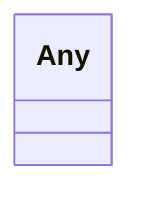

# Class: Any


URI: [linkml:Any](https://w3id.org/linkml/Any)





<!-- no inheritance hierarchy -->


## Slots

| Name | Cardinality and Range | Description | Inheritance |
| ---  | --- | --- | --- |


## Usages

| used by | used in | type | used |
| ---  | --- | --- | --- |
| [Term](Term.md) | [hasRelatedRisk](hasRelatedRisk.md) | domain | [Any](Any.md) |
| [RiskGroup](RiskGroup.md) | [closeMatch](closeMatch.md) | range | [Any](Any.md) |
| [RiskGroup](RiskGroup.md) | [exactMatch](exactMatch.md) | range | [Any](Any.md) |
| [RiskGroup](RiskGroup.md) | [broadMatch](broadMatch.md) | range | [Any](Any.md) |
| [RiskGroup](RiskGroup.md) | [narrowMatch](narrowMatch.md) | range | [Any](Any.md) |
| [RiskGroup](RiskGroup.md) | [relatedMatch](relatedMatch.md) | range | [Any](Any.md) |
| [Risk](Risk.md) | [closeMatch](closeMatch.md) | range | [Any](Any.md) |
| [Risk](Risk.md) | [exactMatch](exactMatch.md) | range | [Any](Any.md) |
| [Risk](Risk.md) | [broadMatch](broadMatch.md) | range | [Any](Any.md) |
| [Risk](Risk.md) | [narrowMatch](narrowMatch.md) | range | [Any](Any.md) |
| [Risk](Risk.md) | [relatedMatch](relatedMatch.md) | range | [Any](Any.md) |
| [Action](Action.md) | [hasRelatedRisk](hasRelatedRisk.md) | domain | [Any](Any.md) |
| [AiEval](AiEval.md) | [hasRelatedRisk](hasRelatedRisk.md) | domain | [Any](Any.md) |
| [BenchmarkMetadataCard](BenchmarkMetadataCard.md) | [hasRelatedRisk](hasRelatedRisk.md) | domain | [Any](Any.md) |
| [Question](Question.md) | [hasRelatedRisk](hasRelatedRisk.md) | domain | [Any](Any.md) |
| [Questionnaire](Questionnaire.md) | [hasRelatedRisk](hasRelatedRisk.md) | domain | [Any](Any.md) |
| [LLMIntrinsic](LLMIntrinsic.md) | [hasRelatedRisk](hasRelatedRisk.md) | domain | [Any](Any.md) |
| [LLMIntrinsic](LLMIntrinsic.md) | [hasRelatedTerm](hasRelatedTerm.md) | domain | [Any](Any.md) |


## Identifier and Mapping Information


### Schema Source


* from schema: https://ibm.github.io/risk-atlas-nexus/ontology/ai-risk-ontology


## Mappings

| Mapping Type | Mapped Value |
| ---  | ---  |
| self | linkml:Any |
| native | nexus:Any |


## LinkML Source

<!-- TODO: investigate https://stackoverflow.com/questions/37606292/how-to-create-tabbed-code-blocks-in-mkdocs-or-sphinx -->

### Direct

<details>
```yaml
name: Any
from_schema: https://ibm.github.io/risk-atlas-nexus/ontology/ai-risk-ontology
class_uri: linkml:Any

```
</details>

### Induced

<details>
```yaml
name: Any
from_schema: https://ibm.github.io/risk-atlas-nexus/ontology/ai-risk-ontology
class_uri: linkml:Any

```
</details>
