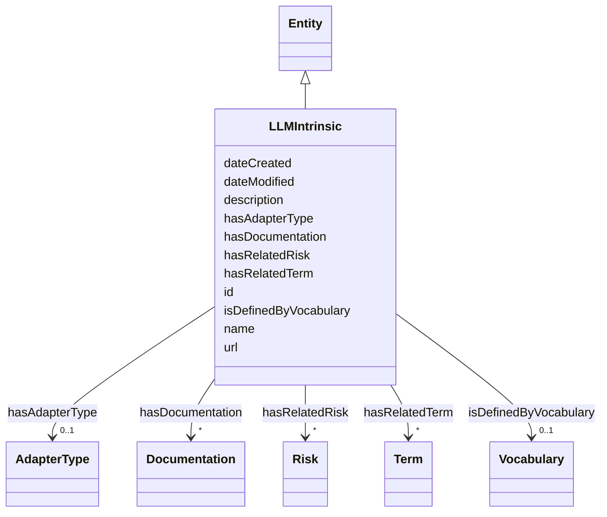

# Class: LLMIntrinsic


_A capability that can be invoked through a well-defined API that is reasonably stable and independent of how the LLM intrinsic itself is implemented._


URI: [nexus:LLMIntrinsic](https://ibm.github.io/risk-atlas-nexus/ontology/LLMIntrinsic)





## Inheritance
* [Entity](Entity.md)
    * **LLMIntrinsic**


## Slots

| Name | Cardinality and Range | Description | Inheritance |
| ---  | --- | --- | --- |
| [hasRelatedRisk](hasRelatedRisk.md) | * <br/> [Risk](Risk.md)&nbsp;or&nbsp;<br />[RiskConcept](RiskConcept.md)&nbsp;or&nbsp;<br />[Term](Term.md) | A relationship where an entity relates to a risk | direct |
| [hasRelatedTerm](hasRelatedTerm.md) | * <br/> [Term](Term.md)&nbsp;or&nbsp;<br />[RiskConcept](RiskConcept.md)&nbsp;or&nbsp;<br />[Term](Term.md) | A relationship where an entity relates to a term | direct |
| [hasAdapterType](hasAdapterType.md) | 0..1 <br/> [AdapterType](AdapterType.md) | The Adapter type, for example: LORA, ALORA, X-LORA | direct |
| [hasDocumentation](hasDocumentation.md) | * <br/> [Documentation](Documentation.md) | Indicates documentation associated with an entity | direct |
| [isDefinedByVocabulary](isDefinedByVocabulary.md) | 0..1 <br/> [Vocabulary](Vocabulary.md) | A relationship where a term or a term group is defined by a vocabulary | direct |
| [id](id.md) | 1 <br/> [String](String.md) | A unique identifier to this instance of the model element | [Entity](Entity.md) |
| [name](name.md) | 0..1 <br/> [String](String.md) | A text name of this instance | [Entity](Entity.md) |
| [description](description.md) | 0..1 <br/> [String](String.md) | The description of an entity | [Entity](Entity.md) |
| [url](url.md) | 0..1 <br/> [Uri](Uri.md) | An optional URL associated with this instance | [Entity](Entity.md) |
| [dateCreated](dateCreated.md) | 0..1 <br/> [Date](Date.md) | The date on which the entity was created | [Entity](Entity.md) |
| [dateModified](dateModified.md) | 0..1 <br/> [Date](Date.md) | The date on which the entity was most recently modified | [Entity](Entity.md) |


## Usages

| used by | used in | type | used |
| ---  | --- | --- | --- |
| [Container](Container.md) | [llmintrinsics](llmintrinsics.md) | range | [LLMIntrinsic](LLMIntrinsic.md) |


## Identifier and Mapping Information


### Schema Source


* from schema: https://ibm.github.io/risk-atlas-nexus/ontology/ai-risk-ontology


## Mappings

| Mapping Type | Mapped Value |
| ---  | ---  |
| self | nexus:LLMIntrinsic |
| native | nexus:LLMIntrinsic |


## LinkML Source

<!-- TODO: investigate https://stackoverflow.com/questions/37606292/how-to-create-tabbed-code-blocks-in-mkdocs-or-sphinx -->

### Direct

<details>
```yaml
name: LLMIntrinsic
description: A capability that can be invoked through a well-defined API that is reasonably
  stable and independent of how the LLM intrinsic itself is implemented.
from_schema: https://ibm.github.io/risk-atlas-nexus/ontology/ai-risk-ontology
is_a: Entity
slots:
- hasRelatedRisk
- hasRelatedTerm
- hasAdapterType
- hasDocumentation
- isDefinedByVocabulary

```
</details>

### Induced

<details>
```yaml
name: LLMIntrinsic
description: A capability that can be invoked through a well-defined API that is reasonably
  stable and independent of how the LLM intrinsic itself is implemented.
from_schema: https://ibm.github.io/risk-atlas-nexus/ontology/ai-risk-ontology
is_a: Entity
attributes:
  hasRelatedRisk:
    name: hasRelatedRisk
    description: A relationship where an entity relates to a risk
    from_schema: https://ibm.github.io/risk-atlas-nexus/ontology/ai-risk-ontology
    rank: 1000
    domain: Any
    alias: hasRelatedRisk
    owner: LLMIntrinsic
    domain_of:
    - Term
    - Action
    - AiEval
    - BenchmarkMetadataCard
    - LLMIntrinsic
    range: Risk
    multivalued: true
    inlined: false
    any_of:
    - range: RiskConcept
    - range: Term
  hasRelatedTerm:
    name: hasRelatedTerm
    description: A relationship where an entity relates to a term
    from_schema: https://ibm.github.io/risk-atlas-nexus/ontology/ai-risk-ontology
    rank: 1000
    domain: Any
    alias: hasRelatedTerm
    owner: LLMIntrinsic
    domain_of:
    - LLMIntrinsic
    range: Term
    multivalued: true
    inlined: false
    any_of:
    - range: RiskConcept
    - range: Term
  hasAdapterType:
    name: hasAdapterType
    description: 'The Adapter type, for example: LORA, ALORA, X-LORA'
    from_schema: https://ibm.github.io/risk-atlas-nexus/ontology/ai-risk-ontology
    rank: 1000
    alias: hasAdapterType
    owner: LLMIntrinsic
    domain_of:
    - LLMIntrinsic
    range: AdapterType
  hasDocumentation:
    name: hasDocumentation
    description: Indicates documentation associated with an entity.
    from_schema: https://ibm.github.io/risk-atlas-nexus/ontology/ai-risk-ontology
    rank: 1000
    slot_uri: airo:hasDocumentation
    alias: hasDocumentation
    owner: LLMIntrinsic
    domain_of:
    - Dataset
    - Vocabulary
    - Term
    - RiskTaxonomy
    - Action
    - BaseAi
    - LargeLanguageModelFamily
    - AiEval
    - BenchmarkMetadataCard
    - LLMIntrinsic
    range: Documentation
    multivalued: true
    inlined: false
  isDefinedByVocabulary:
    name: isDefinedByVocabulary
    description: A relationship where a term or a term group is defined by a vocabulary
    from_schema: https://ibm.github.io/risk-atlas-nexus/ontology/ai-risk-ontology
    rank: 1000
    slot_uri: schema:isPartOf
    alias: isDefinedByVocabulary
    owner: LLMIntrinsic
    domain_of:
    - Term
    - LLMIntrinsic
    range: Vocabulary
  id:
    name: id
    description: A unique identifier to this instance of the model element. Example
      identifiers include UUID, URI, URN, etc.
    from_schema: https://ibm.github.io/risk-atlas-nexus/ontology/ai-risk-ontology
    rank: 1000
    slot_uri: schema:identifier
    identifier: true
    alias: id
    owner: LLMIntrinsic
    domain_of:
    - Entity
    range: string
    required: true
  name:
    name: name
    description: A text name of this instance.
    from_schema: https://ibm.github.io/risk-atlas-nexus/ontology/ai-risk-ontology
    rank: 1000
    slot_uri: schema:name
    alias: name
    owner: LLMIntrinsic
    domain_of:
    - Entity
    - BenchmarkMetadataCard
    range: string
  description:
    name: description
    description: The description of an entity
    from_schema: https://ibm.github.io/risk-atlas-nexus/ontology/ai-risk-ontology
    rank: 1000
    slot_uri: schema:description
    alias: description
    owner: LLMIntrinsic
    domain_of:
    - Entity
    range: string
  url:
    name: url
    description: An optional URL associated with this instance.
    from_schema: https://ibm.github.io/risk-atlas-nexus/ontology/ai-risk-ontology
    rank: 1000
    slot_uri: schema:url
    alias: url
    owner: LLMIntrinsic
    domain_of:
    - Entity
    range: uri
  dateCreated:
    name: dateCreated
    description: The date on which the entity was created.
    from_schema: https://ibm.github.io/risk-atlas-nexus/ontology/ai-risk-ontology
    rank: 1000
    slot_uri: schema:dateCreated
    alias: dateCreated
    owner: LLMIntrinsic
    domain_of:
    - Entity
    range: date
    required: false
  dateModified:
    name: dateModified
    description: The date on which the entity was most recently modified.
    from_schema: https://ibm.github.io/risk-atlas-nexus/ontology/ai-risk-ontology
    rank: 1000
    slot_uri: schema:dateModified
    alias: dateModified
    owner: LLMIntrinsic
    domain_of:
    - Entity
    range: date
    required: false

```
</details>
