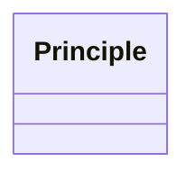

# Class: Principle


_A representation of values or norms that must be taken into consideration when conducting activities_


URI: [dpv:Principle](https://w3id.org/dpv#Principle)





<!-- no inheritance hierarchy -->


## Slots

| Name | Cardinality and Range | Description | Inheritance |
| ---  | --- | --- | --- |


## Identifier and Mapping Information


### Schema Source


* from schema: https://ibm.github.io/risk-atlas-nexus/ontology/ai-risk-ontology


## Mappings

| Mapping Type | Mapped Value |
| ---  | ---  |
| self | dpv:Principle |
| native | nexus:Principle |


## LinkML Source

<!-- TODO: investigate https://stackoverflow.com/questions/37606292/how-to-create-tabbed-code-blocks-in-mkdocs-or-sphinx -->

### Direct

<details>
```yaml
name: Principle
description: A representation of values or norms that must be taken into consideration
  when conducting activities
from_schema: https://ibm.github.io/risk-atlas-nexus/ontology/ai-risk-ontology
class_uri: dpv:Principle

```
</details>

### Induced

<details>
```yaml
name: Principle
description: A representation of values or norms that must be taken into consideration
  when conducting activities
from_schema: https://ibm.github.io/risk-atlas-nexus/ontology/ai-risk-ontology
class_uri: dpv:Principle

```
</details>
